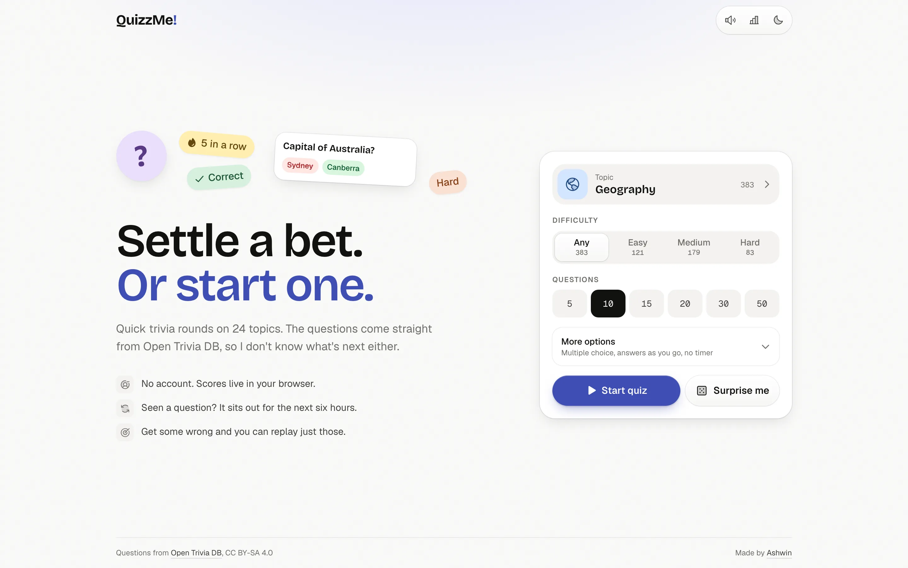
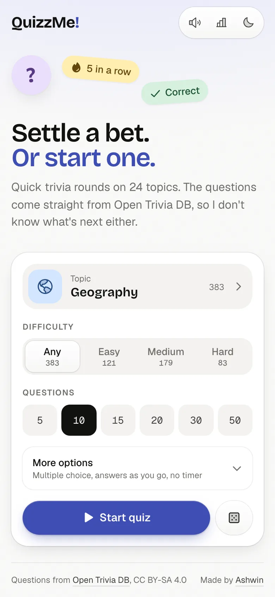
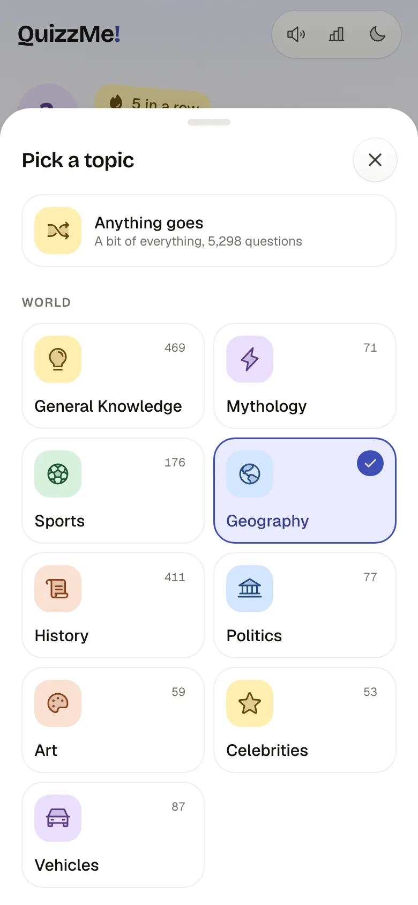
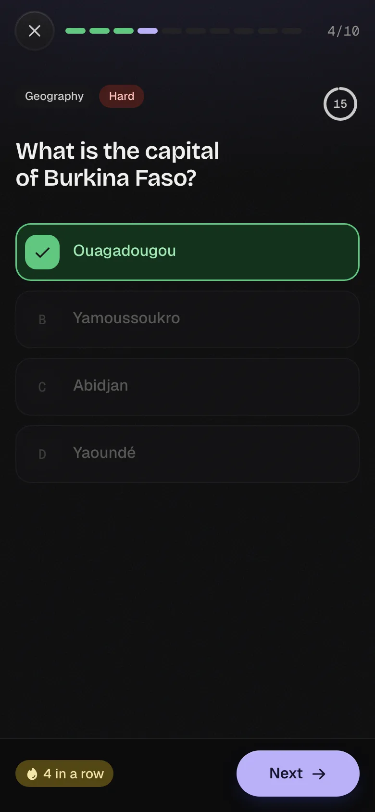
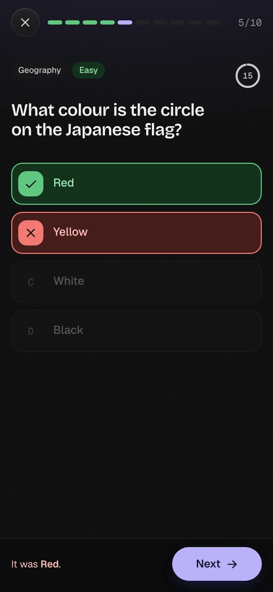
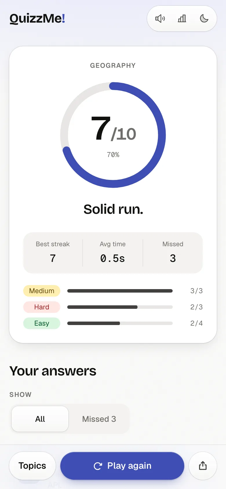
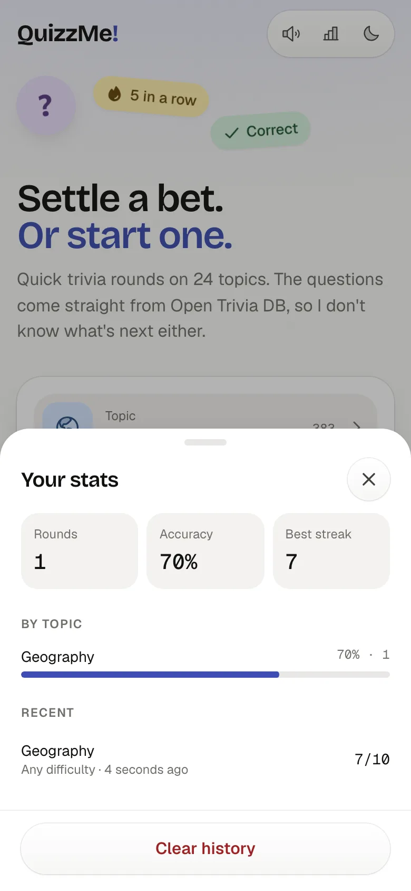
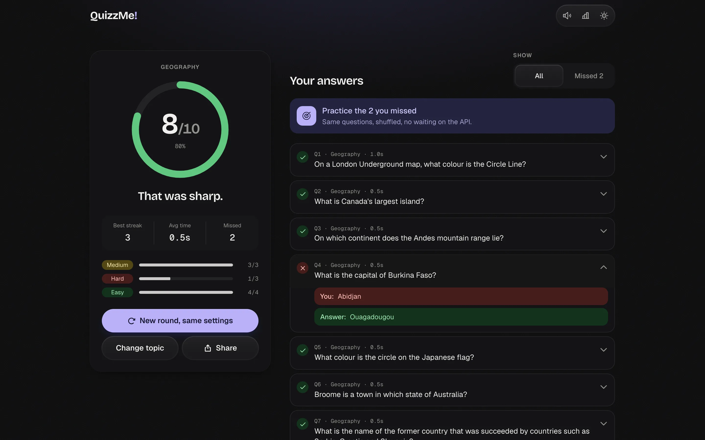
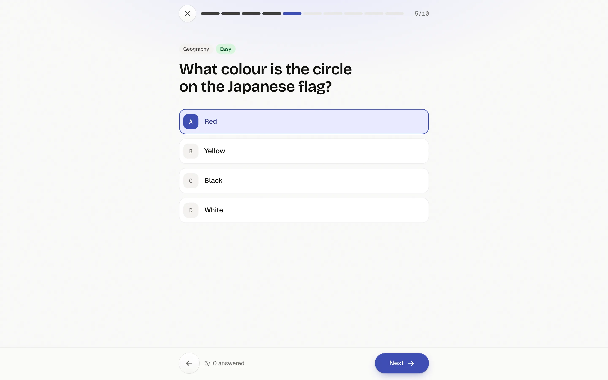
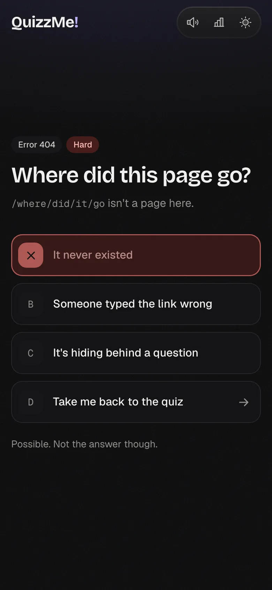

# QuizzMe!

<div align="center">


Quick trivia rounds on 24 topics, with questions pulled live from [Open Trivia DB](https://opentdb.com/api_config.php).

[Features](#features) • [Tech Stack](#tech-stack) • [Installation](#installation) • [Contributing](#contributing) • [Screenshots](#screenshots)

</div>

## Features

- **Live topics and counts**: categories come from `api_category.php`, and every topic shows how many checked questions it has, from one `api_count_global.php` call. Picking a topic loads its per difficulty counts, and the question amounts cap at what actually exists, so a round never asks for more than the API can give. Counts roll into place like an odometer when they load or change.
- **No repeats**: a session token is kept for its six hours, so back to back rounds don't serve the same questions. When a mix runs dry you get the option to start it over.
- **Honest about the rate limit**: Open Trivia DB allows one question request every 5 seconds per IP. Requests are queued, a 429 or code 5 is retried, and the loading screen tells you how long the wait is.
- **One screen to start**: pick a topic from a sheet, set the difficulty and amount, and go. Everything else folds into More options, and Surprise me picks a random topic for you.
- **Two ways to play**: see each answer as you go, with streaks, or answer everything and reveal at the end, with free navigation between questions.
- **Optional timer**: 15 or 30 seconds per question.
- **Results worth reading**: animated score ring, best streak, average time, a split by difficulty, and a review of every answer.
- **Practice what you missed**: replay only the questions you got wrong, reshuffled, without another API call.
- **Share**: a result grid through the native share sheet on phones, or the clipboard elsewhere, with a link that opens the same setup.
- **Stats on this device**: rounds, accuracy, best streak, and accuracy by topic, kept in `localStorage`.
- **Keyboard**: `1` to `4` or `A` to `D` to answer, `Enter` for next, arrows to move in reveal at end mode, `Esc` to leave.
- **Feels native on phones**: bottom action bars clear the home indicator, the quit and stats sheets drag to dismiss, the back button asks before throwing a round away, light haptics on Android, and it installs as a PWA.
- **Sounds**: small synthesized clicks, a chime that climbs with your streak, a buzz for wrong answers and a timer tick, all made with the Web Audio API. Audio only starts after your first interaction, respects the iOS silent switch, and mutes in one tap.
- **A 404 that is also a question**, and every screen sets its own page title.
- **No layout shift**: fonts are self-hosted and preloaded with metric-matched fallbacks, and the landing fits one screen from an iPhone SE up to desktop.
- **Light and dark**: follows the system until you choose, and switches with a crossfade.
- **Reduced motion**: movement is swapped for fades when the system asks for it.

## Tech Stack

- **[React 19](https://react.dev/)** with **[Vite 8](https://vite.dev/)**
- **[Tailwind CSS 4](https://tailwindcss.com/)** with OKLCH theme tokens
- **[Motion](https://motion.dev/)** for question transitions, sheets, layout and springs
- **[Phosphor Icons](https://phosphoricons.com)** (duotone), with unused weights stripped at build time
- **[canvas-confetti](https://www.npmjs.com/package/canvas-confetti)** for the good rounds
- **Geist**, **Geist Mono** and **Bricolage Grotesque**, self-hosted and preloaded with metric-matched fallbacks so nothing shifts when they load
- **[Biome](https://biomejs.dev/)** for linting and formatting, and `node --test` for the quiz logic

## Installation

```bash
git clone https://github.com/Ashwin-S-Nambiar/QuizzMe.git
cd QuizzMe
npm install
npm run dev
```

`npm test` runs the logic tests, `npm run check` runs Biome, and `npm run build` makes a production build.

## Contributing

Contributions are welcome! Here's how you can help improve QuizzMe!:

1. Fork the repository
2. Create a feature branch:

   ```bash
   git checkout -b feature/amazing-feature
   ```

3. Commit your changes:

   ```bash
   git commit -m 'Add some amazing feature'
   ```

4. Push to the branch:

   ```bash
   git push origin feature/amazing-feature
   ```

5. Open a Pull Request

## Screenshots



<table>
  <tr>
    <td width="33%"></td>
    <td width="33%"></td>
    <td width="33%"></td>
  </tr>
  <tr>
    <td width="33%"></td>
    <td width="33%"></td>
    <td width="33%"></td>
  </tr>
</table>






