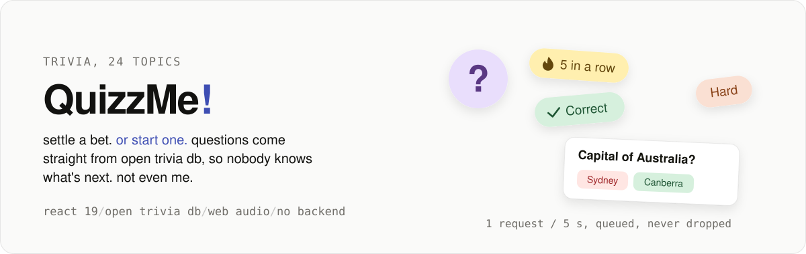

<p align="center">
  <a href="https://quizzme.ashwin.co.in">
    
  </a>
</p>

<p align="center">
  <a href="https://quizzme.ashwin.co.in"><strong>quizzme.ashwin.co.in</strong></a>
  &nbsp;·&nbsp;
  <a href="#what-it-does">what it does</a>
  &nbsp;·&nbsp;
  <a href="#one-request-every-five-seconds">the rate limit</a>
  &nbsp;·&nbsp;
  <a href="#running-it">running it</a>
</p>

<br>

<p align="center">
  
</p>

the source of **[quizzme.ashwin.co.in](https://quizzme.ashwin.co.in)**. quick trivia rounds on 24 topics, with the questions pulled live from [open trivia db](https://opentdb.com/api_config.php), so i don't know what's next either.

it is a react spa with no server and no account. your scores stay in your browser. the questions are not the interesting part, since someone else wrote them. the interesting parts are living inside a free api that allows one request every five seconds without making you feel it, and the small sounds, which are synthesized on the spot rather than shipped as files.

## what it does

| screen | what it is |
| --- | --- |
| setup | one card: pick a topic, a difficulty and how many questions, and go. everything else folds into more options, and surprise me picks a topic for you |
| play | one question at a time, either answered as you go with streaks, or all revealed at the end with free movement between questions |
| results | a score ring, best streak, average time, a split by difficulty, and every answer to look back through |
| stats | rounds, accuracy, best streak and accuracy by topic, from your last hundred rounds on this device |
| 404 | a question too: where did this page go? |

<table>
  <tr>
    <td width="33%"></td>
    <td width="33%"></td>
    <td width="33%"></td>
  </tr>
</table>

- **live topics and counts.** topics come from `api_category.php`, and each shows how many checked questions it has, from one `api_count_global.php` call. picking a topic loads its counts per difficulty, and the amounts cap at what exists, so a round never asks for more than the api can give. the numbers roll into place like an odometer.
- **no repeats.** a session token rides along with every request, so back to back rounds don't serve the same questions. when a mix runs dry you get the option to start it over.
- **an optional timer.** 15 or 30 seconds a question, ticking through the last three.
- **practice what you missed.** replay only the questions you got wrong, reshuffled, without another api call.
- **share.** a green and red grid through the share sheet on phones, or the clipboard elsewhere, with a link that opens the same setup for whoever you send it to.
- **keyboard.** `1` to `4` or `a` to `d` to answer, `enter` or `→` for next, `←` to go back in reveal at the end mode, `esc` to leave.
- **the back button asks.** mid-round, back opens the quit sheet instead of throwing the round away.
- **light and dark.** follows the system until you choose. choose, and the new theme grows out of the toggle in a circle. let the system flip it, and the page cross-fades.
- **installable.** it is a pwa, with a maskable icon and a manifest.

<table>
  <tr>
    <td width="33%"></td>
    <td width="33%"></td>
    <td width="33%"></td>
  </tr>
</table>

## one request every five seconds

open trivia db is free and asks for one question request every five seconds per ip. hit it faster and you get a 429, or a `response_code` of 5. rather than hope, the client plans for it.

```js
let chain = Promise.resolve();

function throttle(signal, onWait) {
  const run = chain.then(async () => {
    const wait = (read(LAST_KEY) ?? 0) + GAP - Date.now();
    if (wait > 0) {
      onWait?.(Date.now() + wait);
      await sleep(wait, signal);
    }
    write(LAST_KEY, Date.now());
  });
  chain = run.catch(() => {});
  return run;
}
```

- **one queue.** every question request waits its turn on a single promise chain, 5.2 s apart, so two quick rounds can never collide.
- **it survives a reload.** the time of the last request lives in `localStorage`, not memory, so refreshing the page doesn't reset the clock and earn you a 429.
- **the wait is said out loud.** the queue hands the loading screen a deadline, and it counts down to it rather than spinning.
- **retries that know why.** a 429 or code 5 waits its turn and tries again, up to four times. a lost token (code 3) is dropped and a new one fetched. an empty mix (1) or an exhausted one (4) fails straight away with its own message, because retrying won't help.
- **cancel means cancel.** leaving the loading screen aborts both the wait and the fetch.
- **the token stays warm.** it is reused until it has sat idle for five and a half hours, just inside the six open trivia db allows, and every successful round resets that clock.
- **the cheap calls skip the queue.** topics are cached for a week, counts per topic for the session, and neither counts against the question limit.

## the sounds are made, not played

there are no audio files. every click, chime and buzz is an oscillator and a gain envelope from the web audio api, built the moment it plays:

```js
amp.gain.setValueAtTime(0.0001, t);
amp.gain.exponentialRampToValueAtTime(gain, t + 0.006);
amp.gain.exponentialRampToValueAtTime(0.0001, t + dur);
```

- **the chime climbs.** a right answer plays two triangle notes, and each answer in a streak lifts them a semitone, up to seven.
- **the round has an ending.** finish with 60% or more and it plays a rising c major arpeggio. under that, it walks down.
- **it waits to be asked.** no audio context exists until you have touched the page, so nothing is blocked or suspended on load.
- **it respects the silent switch.** on ios the audio session is set to `ambient`, so a phone on silent stays silent.
- **quiet when hidden.** nothing plays in a background tab, and one tap in the top bar mutes it for good.
- **haptics too.** short vibrations on android, skipped when reduced motion is on.

## small things that took a while

- **numbers roll.** each digit is a strip of 0 to 9 that slides to its value, the places staggered 45 ms apart, while screen readers get the plain number.
- **nothing shifts when fonts load.** geist, geist mono and bricolage grotesque are self-hosted, preloaded and paired with arial fallbacks tuned with `size-adjust` and ascent overrides, so the swap is invisible.
- **one screen, any screen.** the landing fits above the fold from an iphone se up to desktop, with a `short` variant for low viewports.
- **sheets you can throw.** on phones the topic, quit and stats sheets drag to dismiss, and the bottom bars clear the home indicator.
- **icons on a diet.** a small vite plugin strips every phosphor icon weight except bold, duotone and fill at build time.
- **a real 404.** the build copies `index.html` to `404.html`, so any static host serves the app's own not found page, and every screen sets its own title.

<details>
<summary><strong>more screenshots</strong></summary>

<br>


</details>

## the design

- **restraint.** a warm off-white ground, near-black ink, one indigo accent, and green and red kept for right and wrong.
- **stickers for play.** pastel butter, sky, mint, lilac and peach, each topic with its own colour and duotone icon.
- **two families.** bricolage grotesque for the big lines, geist for everything else, geist mono for numbers.
- **oklch tokens.** every colour is an oklch value in one theme block, with a dark set that swaps in on `data-theme`.
- **phones first.** 44 px touch targets, safe-area padding, and actions pinned to the bottom where thumbs are.
- **reduced motion.** movement becomes fades when the system asks for it.

## the stack

| layer | choices |
| --- | --- |
| framework | [react 19](https://react.dev/) · no router, the screens are state, and the url only carries a shared setup |
| styling | [tailwind css 4](https://tailwindcss.com/) with oklch theme tokens · [phosphor icons](https://phosphoricons.com) duotone |
| motion | [motion](https://motion.dev/) for question transitions, sheets and springs · view transitions for the theme · [canvas-confetti](https://www.npmjs.com/package/canvas-confetti) for the good rounds |
| data | [open trivia db](https://opentdb.com/) for topics, counts, tokens and questions · `localStorage` for prefs, stats and the rate limit clock |
| tooling | [vite 8](https://vite.dev/) · [biome](https://biomejs.dev/) · `node --test` for the quiz logic |

no state library. the stores are a 75 line module built on `useSyncExternalStore`.

## running it

you'll need node 20.19+ (vite 8's floor). no api key, open trivia db doesn't need one.

```sh
git clone https://github.com/Ashwin-S-Nambiar/QuizzMe.git
cd QuizzMe
npm install
npm run dev        # http://localhost:5173
```

```sh
npm test           # the quiz logic
npm run check      # lint, format and import order
npm run check:fix  # apply the safe fixes
npm run build && npm run preview
```

## the shape of it

```
src/
  components/  setup, play, results, the stats and topic sheets, stickers,
               the rolling number, toasts, the top and bottom bars, 404
  hooks/       theme, media queries, topics and their counts
  lib/         the open trivia db client and its queue, quiz logic and
               its tests, topic colours and icons, stores, sounds
  index.css    fonts, tokens, both themes, then the few things tailwind
               can't say
```

## known rough edges

- **the first chunk is heavy.** about 145 KB gzipped, mostly react, motion and icons. play, results, stats, the 404 and confetti are split out and load when needed.
- **the limit is per ip.** on shared wifi, someone else's round can make you wait.
- **stats don't travel.** they live in one browser, and clearing site data clears them.
- **the questions are crowd-sourced.** open trivia db's questions are checked, but now and then one is dated or debatable. that's on them, not me. mostly.

## credit

questions come from [open trivia db](https://opentdb.com/), licensed under [cc by-sa 4.0](https://creativecommons.org/licenses/by-sa/4.0/).

---

[quizzme.ashwin.co.in](https://quizzme.ashwin.co.in) · [ashwin.co.in](https://ashwin.co.in) · [notes](https://notes.ashwin.co.in) · [x](https://x.com/ashwinnambiar11) · [github](https://github.com/Ashwin-S-Nambiar)
