<p align="center">
  <a href="https://quizzme.ashwin.co.in">
    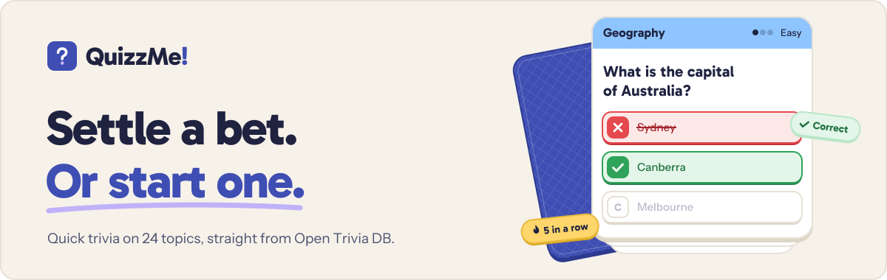
  </a>
</p>

<p align="center">
  <a href="https://quizzme.ashwin.co.in"><strong>quizzme.ashwin.co.in</strong></a>
  &nbsp;·&nbsp;
  <a href="#what-it-does">what it does</a>
  &nbsp;·&nbsp;
  <a href="#one-request-every-five-seconds">the rate limit</a>
  &nbsp;·&nbsp;
  <a href="#running-it">running it</a>
</p>

<br>

<p align="center">
  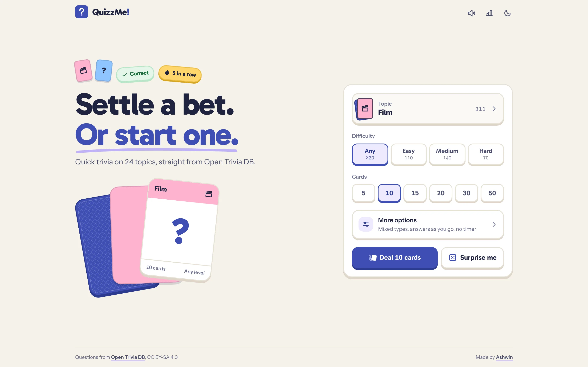
</p>

the source of **[quizzme.ashwin.co.in](https://quizzme.ashwin.co.in)**. quick trivia rounds on 24 topics, with the questions pulled live from [open trivia db](https://opentdb.com/api_config.php), so i don't know what's next either.

it is a react spa with no server and no account. your scores stay in your browser. the questions are not the interesting part, since someone else wrote them. the interesting parts are living inside a free api that allows one request every five seconds without making you feel it, and the small sounds, which are synthesized on the spot rather than shipped as files.

## what it does

| screen | what it is |
| --- | --- |
| setup | the deck box: pick a topic, a difficulty and how many cards, and deal. question type, answer mode and the timer live in a more options sheet, and surprise me picks a topic for you |
| play | one card at a time off a visible deck, thrown aside when you move on. answer as you go and a banner turns green or red with the right answer, or answer everything and reveal it at the end |
| results | a scorecard with the verdict stamped on, a strip of every card right or wrong, best streak, average time, a split by difficulty, and every card to look back through |
| stats | rounds, accuracy, best streak and accuracy by topic, from your last hundred rounds on this device |
| 404 | a question too: where did this page go? |

<table>
  <tr>
    <td width="33%">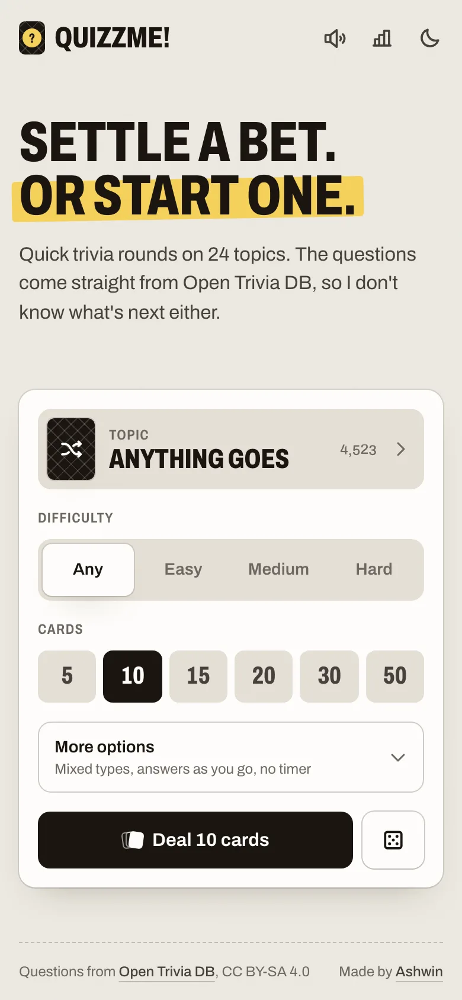</td>
    <td width="33%">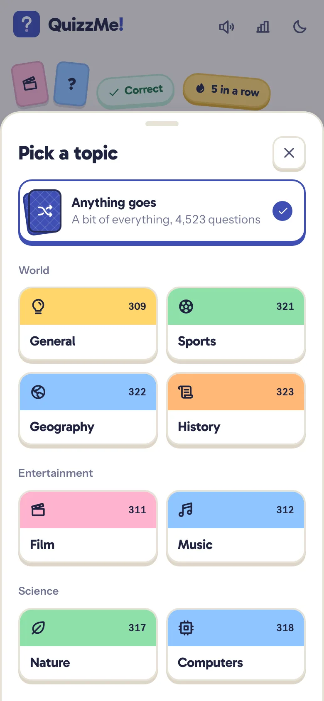</td>
    <td width="33%">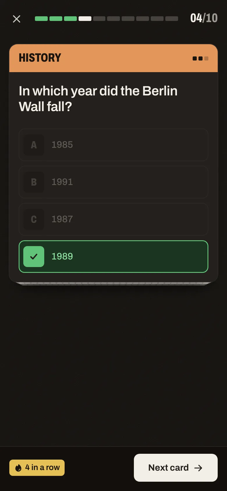</td>
  </tr>
</table>

- **live topics and counts.** topics come from `api_category.php`, and each shows how many checked questions it has, from one `api_count_global.php` call. picking a topic loads its counts per difficulty, and the amounts cap at what exists, so a round never asks for more than the api can give. the numbers roll into place like an odometer.
- **no repeats.** a session token rides along with every request, so back to back rounds don't serve the same questions. when a mix runs dry you get the option to start it over.
- **an optional timer.** 15 or 30 seconds a question, ticking through the last three.
- **practice what you missed.** replay only the questions you got wrong, reshuffled, without another api call.
- **share.** a green and red grid through the share sheet on phones, or the clipboard elsewhere, with a link that opens the same setup for whoever you send it to.
- **keyboard.** `1` to `4` or `a` to `d` to answer, `enter` or `→` for next, `←` to go back in reveal at the end mode, `esc` to leave.
- **the back button asks.** mid-round, back opens the quit sheet instead of throwing the round away.
- **light and dark.** follows the system until you choose. choose, and the new theme grows out of the toggle in a circle. let the system flip it, and the page cross-fades.
- **installable.** it is a pwa, with a maskable icon and a manifest.

<table>
  <tr>
    <td width="33%">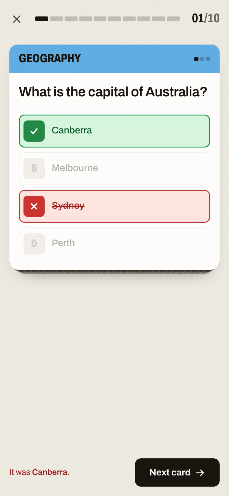</td>
    <td width="33%">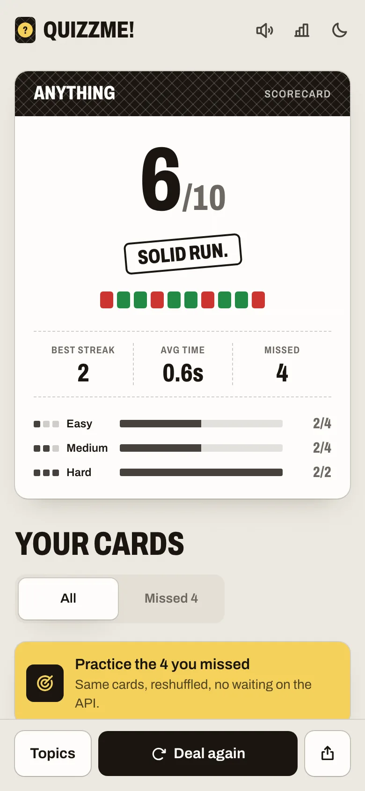</td>
    <td width="33%">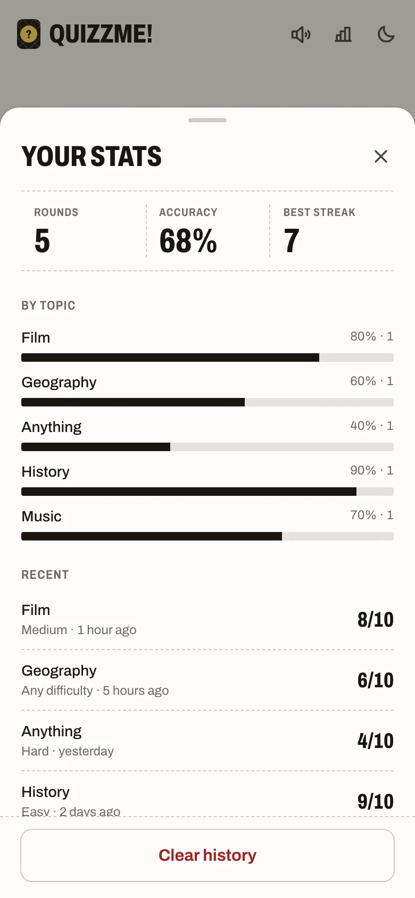</td>
  </tr>
</table>

## one request every five seconds

open trivia db is free and asks for one question request every five seconds per ip. hit it faster and you get a 429, or a `response_code` of 5. rather than hope, the client plans for it.

```js
let chain = Promise.resolve();

function throttle(signal, onWait) {
  const run = chain.then(async () => {
    const wait = (read(LAST_KEY) ?? 0) + GAP - Date.now();
    if (wait > 0) {
      onWait?.(Date.now() + wait);
      await sleep(wait, signal);
    }
    write(LAST_KEY, Date.now());
  });
  chain = run.catch(() => {});
  return run;
}
```

- **one queue.** every question request waits its turn on a single promise chain, 5.2 s apart, so two quick rounds can never collide.
- **it survives a reload.** the time of the last request lives in `localStorage`, not memory, so refreshing the page doesn't reset the clock and earn you a 429.
- **the wait is said out loud.** the queue hands the deal button a deadline, and the line under it counts down rather than spinning.
- **fast answers never flash.** the page stays where it is while cards are fetched. a busy state only appears after 250 ms, and once it does it stays for at least 450 ms, so a quick response goes straight to the first card and a slow one never blinks.
- **retries that know why.** a 429 or code 5 waits its turn and tries again, up to four times. a lost token (code 3) is dropped and a new one fetched. an empty mix (1) or an exhausted one (4) fails straight away with its own message, because retrying won't help.
- **cancel means cancel.** cancelling a deal aborts both the wait and the fetch.
- **errors stay where you were.** a failed deal opens a note right under the button you pressed, with retry, instead of a toast somewhere else.
- **the token stays warm.** it is reused until it has sat idle for five and a half hours, just inside the six open trivia db allows, and every successful round resets that clock.
- **the cheap calls skip the queue.** topics are cached for a week, counts per topic for the session, and neither counts against the question limit.

## the sounds are made, not played

there are no audio files. every knock, riffle and chime is built from oscillators, filtered noise and gain envelopes in the web audio api, the moment it plays, and each one is paired with a haptic pattern:

```js
amp.gain.setValueAtTime(0.0001, t);
amp.gain.exponentialRampToValueAtTime(gain, t + 0.006);
amp.gain.exponentialRampToValueAtTime(0.0001, t + dur);
```

- **controls sound like what they do.** buttons knock like a chunky key, chips pop, the deal buttons riffle a deck of cards, and each new card brushes off the pile.
- **the chime climbs.** a right answer plays two marimba notes, and each answer in a streak lifts them a semitone, up to seven. from three in a row a third note sparkles on top.
- **wrong is gentle.** a soft, low bonk-bonk rather than a buzzer, and running out of time walks three notes down.
- **the round has an ending.** finish with 60% or more and a mallet arpeggio climbs; under that, it walks down. then the verdict lands on the scorecard with a thump.
- **one limiter.** everything runs through a compressor on the way out, so stacked notes never clip.
- **it waits to be asked.** no audio context exists until you have touched the page, so nothing is blocked or suspended on load.
- **it respects the silent switch.** on ios the audio session is set to `ambient`, so a phone on silent stays silent.
- **quiet when hidden.** nothing plays in a background tab, and one tap in the top bar mutes it for good.
- **haptics to match.** named patterns on android: a tap for presses, a double pulse for a deal, a lift for a right answer, a heavier thud-thud for a wrong one, and a longer pattern when a good round is stamped. skipped when reduced motion is on.

## small things that took a while

- **numbers roll.** each digit is a strip of 0 to 9 that slides to its value, the places staggered 45 ms apart, while screen readers get the plain number.
- **nothing shifts when fonts load.** gabarito and instrument sans are self-hosted, preloaded and paired with arial fallbacks tuned with `size-adjust` and ascent overrides, so the swap is invisible.
- **nothing shifts, anywhere.** one header stays put for every screen and play puts its progress into it. presses sink a control into its own edge with a transform. the feedback banner keeps one height in every state. measured with the browser's layout shift api through a whole round: zero.
- **one screen, any screen.** setup, play and the 404 fit without scrolling from an iphone se to a 1920 px desktop. from tablets up, results hold still and only the list of cards scrolls. the landing uses the extra room for a fanned hand of cards, at full size or 70% depending on height.
- **sheets you can throw.** on phones the topic, quit and stats sheets drag to dismiss, and the bottom bars clear the home indicator.
- **icons on a diet.** a small vite plugin strips every phosphor icon weight except bold and fill at build time.
- **a real 404.** the build copies `index.html` to `404.html`, so any static host serves the app's own not found page, and every screen sets its own title.

<details>
<summary><strong>more screenshots</strong></summary>

<br>

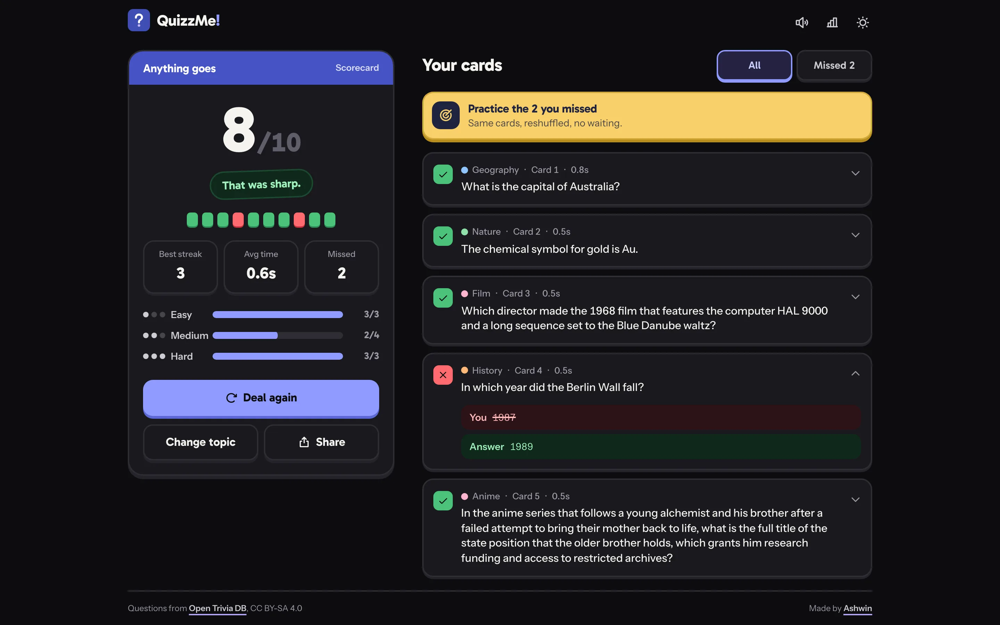

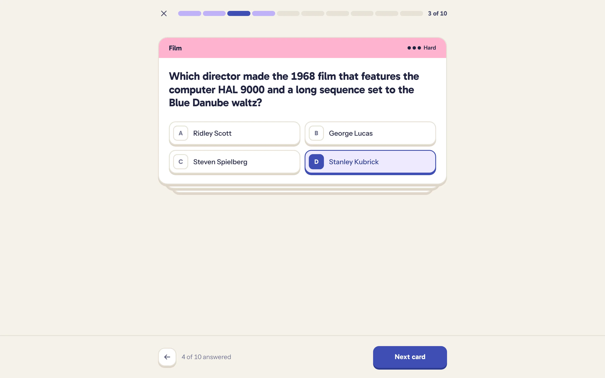

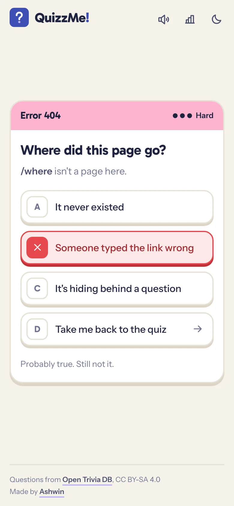

</details>

## the design

- **game night.** a deck of trivia cards with the feel of a game you can press. every button, chip and answer is a tactile tile: a 2px border and a solid bottom edge it sinks into.
- **the icon's colours.** the indigo and lilac from the app icon carry the brand: the main action, what's selected and the backs of the cards. warm paper in light mode, near-black in dark.
- **printed topic colours.** yellow, blue, green, pink and orange across the top of each card, with difficulty as dots.
- **two families.** gabarito for anything printed on a card or a button, instrument sans for what you read. sentence case everywhere, no capitals for effect.
- **feedback you can't miss.** answers tick or strike through as you watch, and a banner along the bottom turns green or red with the right answer in it.
- **motion that means something.** cards are dealt, thrown and pulled back, and the verdict is stamped. a few durations, one ease-out curve, no blur.
- **phones first.** 44 px touch targets, safe-area padding, and actions pinned to the bottom where thumbs are.
- **reduced motion.** movement becomes fades when the system asks for it.

## the stack

| layer | choices |
| --- | --- |
| framework | [react 19](https://react.dev/) · no router, the screens are state, and the url only carries a shared setup |
| styling | [tailwind css 4](https://tailwindcss.com/) with theme tokens · [gabarito](https://fonts.google.com/specimen/Gabarito) and [instrument sans](https://fonts.google.com/specimen/Instrument+Sans) · [phosphor icons](https://phosphoricons.com) bold |
| motion | [motion](https://motion.dev/) for dealing cards, sheets and springs · view transitions for the theme |
| data | [open trivia db](https://opentdb.com/) for topics, counts, tokens and questions · `localStorage` for prefs, stats and the rate limit clock |
| tooling | [vite 8](https://vite.dev/) · [biome](https://biomejs.dev/) · `node --test` for the quiz logic |

no state library. the stores are a 75 line module built on `useSyncExternalStore`.

## running it

you'll need node 20.19+ (vite 8's floor). no api key, open trivia db doesn't need one.

```sh
git clone https://github.com/Ashwin-S-Nambiar/QuizzMe.git
cd QuizzMe
npm install
npm run dev        # http://localhost:5173
```

```sh
npm test           # the quiz logic
npm run check      # lint, format and import order
npm run check:fix  # apply the safe fixes
npm run build && npm run preview
```

## the shape of it

```
src/
  components/  setup, play, results, the stats, topic and options sheets,
               the deal note, the rolling number, toasts, the top bar, 404
  hooks/       theme, media queries, topics and their counts
  lib/         the open trivia db client and its queue, quiz logic and
               its tests, topic colours and icons, stores and haptics, sounds
  index.css    fonts, tokens, both themes, then the few things tailwind
               can't say
```

## known rough edges

- **the first chunk is heavy.** about 140 KB gzipped, mostly react, motion and icons. play, results, stats and the 404 are split out and load when needed.
- **the limit is per ip.** on shared wifi, someone else's round can make you wait.
- **stats don't travel.** they live in one browser, and clearing site data clears them.
- **the questions are crowd-sourced.** open trivia db's questions are checked, but now and then one is dated or debatable. that's on them, not me. mostly.

## credit

questions come from [open trivia db](https://opentdb.com/), licensed under [cc by-sa 4.0](https://creativecommons.org/licenses/by-sa/4.0/).

---

[quizzme.ashwin.co.in](https://quizzme.ashwin.co.in) · [ashwin.co.in](https://ashwin.co.in) · [notes](https://notes.ashwin.co.in) · [x](https://x.com/ashwinnambiar11) · [github](https://github.com/Ashwin-S-Nambiar)
